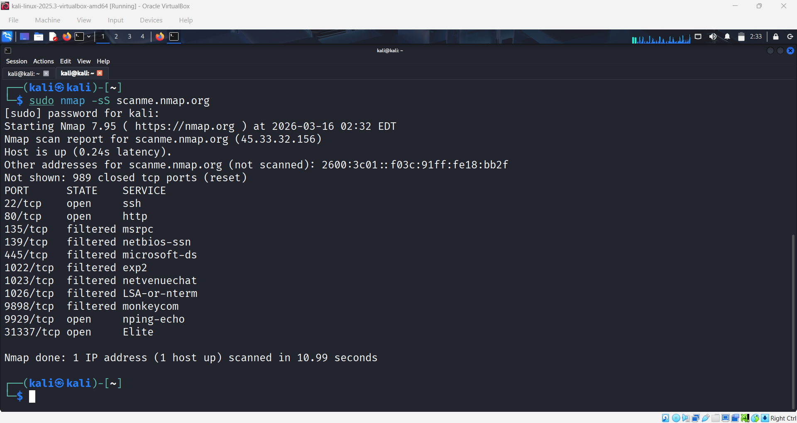
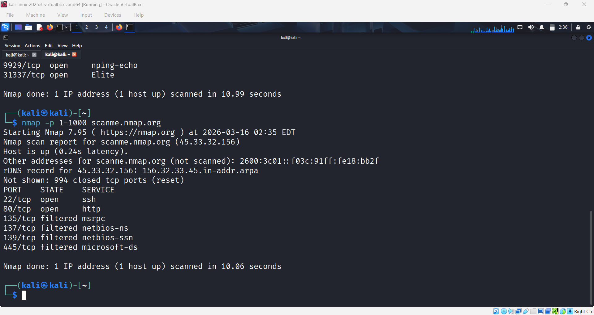
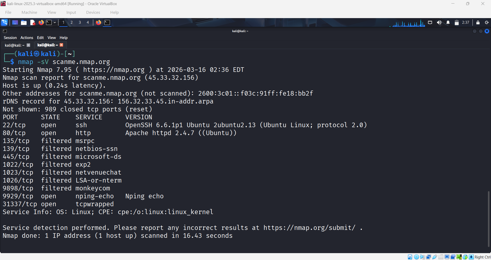
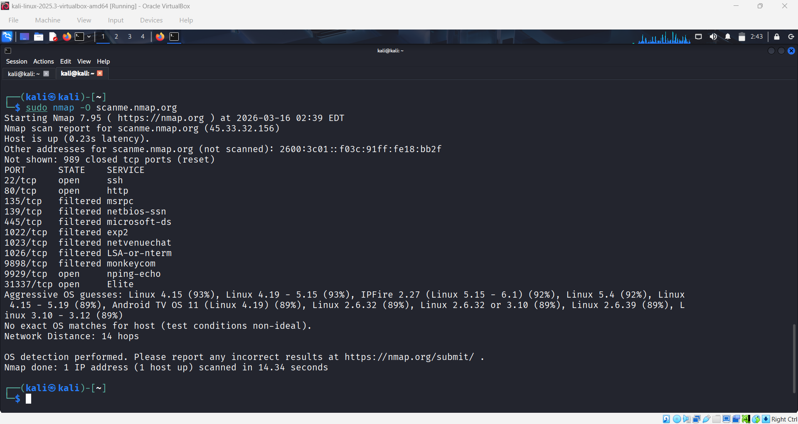
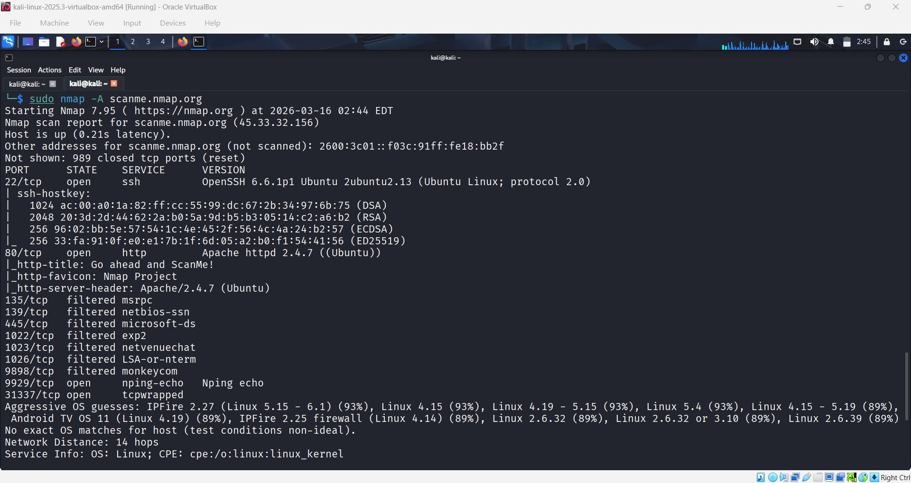
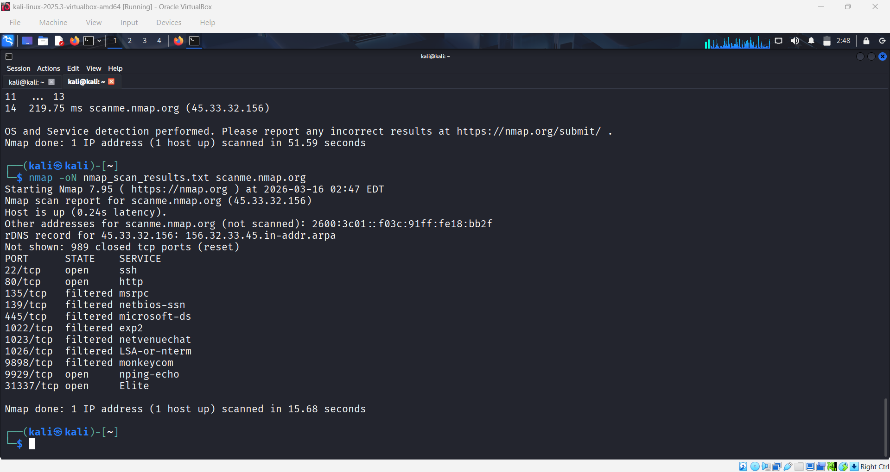

# Nmap Network Scanning Analysis

## Project Overview

This project demonstrates network scanning and enumeration using **Nmap** on Kali Linux.
The objective is to identify open ports, running services, and operating system information of a target host.

Nmap is one of the most widely used tools by cybersecurity professionals for **network discovery, vulnerability assessment, and security auditing**.

---

## Tools Used

* Kali Linux
* Nmap
* Terminal

---

## Target Used

```
scanme.nmap.org
```

This is the official Nmap testing server provided for safe scanning practice.

---

## Nmap Commands Used

### Basic Scan

```
nmap scanme.nmap.org
```

### SYN Scan (Stealth Scan)

```
sudo nmap -sS scanme.nmap.org
```

### Port Range Scan

```
nmap -p 1-1000 scanme.nmap.org
```

### Service Version Detection

```
nmap -sV scanme.nmap.org
```

### Operating System Detection

```
sudo nmap -O scanme.nmap.org
```

### Aggressive Scan

```
sudo nmap -A scanme.nmap.org
```

### Save Scan Output

```
nmap -oN nmap_scan_results.txt scanme.nmap.org
```

---

## Screenshots

### Basic Scan


### SYN Scan



### Port Range Scan



### Service Detection



### OS Detection



### Aggressive Scan



### Scan Output Saved



---

## Key Learnings

* Understanding of network reconnaissance techniques
* Identification of open ports and services
* Service and version detection
* Operating system fingerprinting
* Practical usage of Nmap for security analysis
